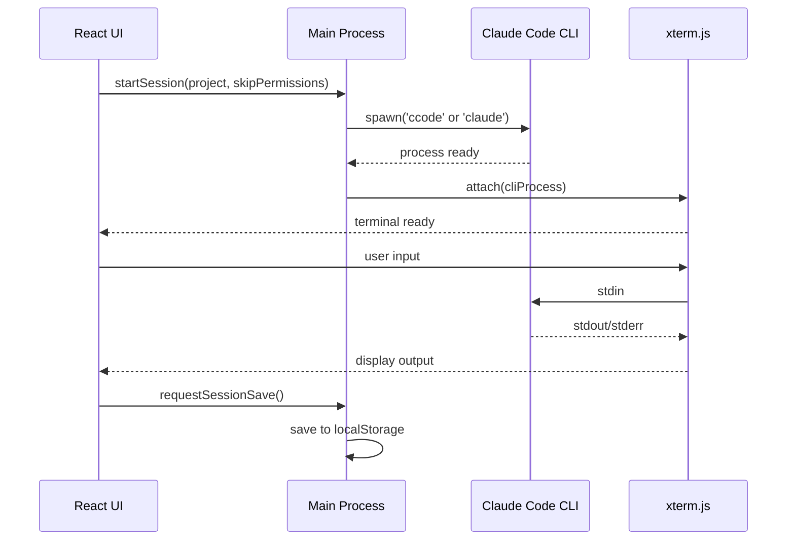

# Cloudy 詳細設計書

## 概要

このドキュメントは、ユーザーフィードバックを反映したCloudyアプリケーションの詳細設計を記述します。  
「6畳に観葉植物を置く」コンセプトの下、実装に必要な画面設計、コンポーネント構造、データフロー等を定義します。

---

## 1. 画面設計・レイアウト

### 1.1 プロジェクト選択画面

#### レイアウト構成
```
┌─────────────────────────────────────────────┐
│ [×] Cloudy - Claude Code GUI                │
├─────────────────────────────────────────────┤
│                                             │
│  Projects                    [Open Project] │
│  Select a project to start working with... │
│                                             │
│  ┌─── Recent Projects ──────────────────────┐ │
│  │                                         │ │
│  │  📁 windsurf-ai        ~/windsurf-ai/  │ │
│  │  📁 virtual-audio      ~/vad/          │ │
│  │  📁 local             ~/.claude/local   │ │
│  │                                         │ │
│  └─────────────────────────────────────────┘ │
│                                             │
└─────────────────────────────────────────────┘
```

#### UI要素詳細
- **ウィンドウタイトル**: "Cloudy - Claude Code GUI"
- **メインタイトル**: "Projects" + "Open Project"ボタン
- **説明文**: "Select a project to start working with Claude Code"
- **Recent Projectsカード**: Claudiaスタイルの角丸カード
- **プロジェクト項目**: フォルダーアイコン + プロジェクト名 + パス

### 1.2 セッション選択画面

#### レイアウト構成
```
┌─────────────────────────────────────────────┐
│ [×] Cloudy - windsurf-ai project            │
├─────────────────────────────────────────────┤
│                                             │
│  windsurf-ai Sessions         [New Session] │
│  Choose session or start new one            │
│                                             │
│  ☑ Skip mode (--dangerously-skip...) │
│                                             │
│  ┌─── Recent Sessions ──────────────────────┐ │
│  │                                         │ │
│  │  🔄 Session - 2025-08-21 23:47         │ │
│  │  📝 Session - 2025-08-21 18:32         │ │
│  │  ✨ Session - 2025-08-20 15:20         │ │
│  │                                         │ │
│  └─────────────────────────────────────────┘ │
│                                             │
└─────────────────────────────────────────────┘
```

#### UI要素詳細
- **プロジェクト名表示**: ウィンドウタイトル + メイン表示
- **権限チェックボックス**: 状態保持、トグル可能
- **New Sessionボタン**: 新規セッション作成
- **Recent Sessionsカード**: セッション履歴一覧
- **セッション項目**: ステータスアイコン + 日時

### 1.3 対話画面（メイン画面）

#### レイアウト構成
```
┌─────────────────────────────────────────────┐
│ [×] Cloudy - windsurf-ai/cloudy             │
├─────────────────────────────────────────────┤
│                                             │
│  ┌─── 会話エリア ─────────────────────────────┐ │
│  │ 🤖 Welcome! How can I help you today?  │ │
│  │                                       │ │
│  │ 👤 Please help me create a new...     │ │
│  │                                       │ │
│  │ 🤖 I'll help you create that. Let me  │ │
│  │    start by...                        │ │
│  │                                       │ │
│  └─────────────────────────────────────────┘ │
│                                             │
│  ┌─────────────────────────────────────────┐ │
│  │ > Message Claude (@for files, /for...) │ │
│  └─────────────────────────────────────────┘ │
│                                             │
└─────────────────────────────────────────────┘
```

#### UI要素詳細
- **会話エリア**: スクロール可能な縦長エリア
- **メッセージカード**: 🤖Claude、👤User のアイコン付き
  claudeとuserのアイコンはゆくゆく特定の画像にしたい。
- **入力エリア**: 画面下部固定、Claude Code形式プレースホルダー
- **ターミナル統合**: 入力エリアがxterm.js統合

---

## 2. コンポーネント構造設計

### 2.1 Reactコンポーネントツリー

```
App
├── ProjectSelector
│   ├── ProjectHeader
│   ├── RecentProjectsList
│   └── ProjectItem
│
├── SessionSelector  
│   ├── SessionHeader
│   ├── PermissionCheckbox
│   ├── RecentSessionsList
│   └── SessionItem
│
├── ChatInterface
│   ├── ConversationArea
│   │   ├── MessageCard (Claude)
│   │   └── MessageCard (User)
│   ├── TerminalInput (xterm.js統合)
│   └── StatusBar
│
└── ThemeProvider
    ├── MorningTheme (Light/Dark)
    └── EveningTheme (Light/Dark)
```

### 2.2 主要コンポーネント仕様

#### ProjectSelector
```typescript
interface ProjectSelectorProps {
  onProjectSelect: (project: Project) => void;
}

interface Project {
  name: string;
  path: string;
  lastAccessed: Date;
}
```

#### SessionSelector
```typescript
interface SessionSelectorProps {
  project: Project;
  onSessionSelect: (session: Session | 'new') => void;
}

interface Session {
  id: string;
  createdAt: Date;
  lastMessage: string;
  status: 'active' | 'completed' | 'interrupted';
}
```

#### ChatInterface
```typescript
interface ChatInterfaceProps {
  project: Project;
  session: Session;
}

interface Message {
  id: string;
  type: 'user' | 'claude';
  content: string;
  timestamp: Date;
}
```

#### PermissionCheckbox
```typescript
interface PermissionCheckboxProps {
  checked: boolean;
  onChange: (checked: boolean) => void;
  persistent: true; // localStorage自動保存
}
```

---

## 3. カラーパレット設計

### 3.1 朝テーマ（Morning Theme）

#### 朝ライトモード
```css
:root[data-theme="morning-light"] {
  /* 基本色 */
  --bg-primary: linear-gradient(135deg, #E6F3FF 0%, #FFF0F5 100%);
  --bg-secondary: rgba(255, 255, 255, 0.8);
  --text-primary: #2D3748;
  --text-secondary: #4A5568;
  
  /* アクセント色 */
  --accent-primary: #3182CE;    /* 水色系 */
  --accent-secondary: #E53E3E;  /* 朝の太陽色 */
  
  /* UI要素 */
  --border-color: rgba(199, 210, 254, 0.3);
  --card-bg: rgba(255, 255, 255, 0.9);
  --button-bg: #3182CE;
  --button-hover: #2B77C7;
}
```

#### 朝ダークモード
```css
:root[data-theme="morning-dark"] {
  /* 基本色 */
  --bg-primary: linear-gradient(135deg, #1A202C 0%, #2D3748 100%);
  --bg-secondary: rgba(45, 55, 72, 0.8);
  --text-primary: #F7FAFC;
  --text-secondary: #E2E8F0;
  
  /* アクセント色 */
  --accent-primary: #63B3ED;    /* 優しい水色 */
  --accent-secondary: #F56565;  /* 温かいピンク */
  
  /* UI要素 */
  --border-color: rgba(99, 179, 237, 0.2);
  --card-bg: rgba(45, 55, 72, 0.9);
  --button-bg: #63B3ED;
  --button-hover: #4299E1;
}
```

### 3.2 夕テーマ（Evening Theme）

#### 夕ライトモード
```css
:root[data-theme="evening-light"] {
  /* 基本色 */
  --bg-primary: linear-gradient(135deg, #FDF2F8 0%, #F3E8FF 100%);
  --bg-secondary: rgba(255, 255, 255, 0.8);
  --text-primary: #2D3748;
  --text-secondary: #4A5568;
  
  /* アクセント色 */
  --accent-primary: #8B5CF6;    /* 紫系 */
  --accent-secondary: #EC4899;  /* ピンク系 */
  
  /* UI要素 */
  --border-color: rgba(196, 181, 253, 0.3);
  --card-bg: rgba(255, 255, 255, 0.9);
  --button-bg: #8B5CF6;
  --button-hover: #7C3AED;
}
```

#### 夕ダークモード
```css
:root[data-theme="evening-dark"] {
  /* 基本色 */
  --bg-primary: linear-gradient(135deg, #1A1B2E 0%, #16213E 100%);
  --bg-secondary: rgba(26, 27, 46, 0.8);
  --text-primary: #F7FAFC;
  --text-secondary: #E2E8F0;
  
  /* アクセント色 */  
  --accent-primary: #A78BFA;    /* 優しい紫 */
  --accent-secondary: #F472B6;  /* 優しいピンク */
  
  /* UI要素 */
  --border-color: rgba(167, 139, 250, 0.2);
  --card-bg: rgba(26, 27, 46, 0.9);
  --button-bg: #A78BFA;
  --button-hover: #8B5CF6;
}
```

### 3.3 和紙風背景テクスチャ

```css
/* 和紙風のサブトル・テクスチャ */
.washi-texture {
  background-image: 
    radial-gradient(circle at 20% 50%, rgba(255,255,255,0.1) 1px, transparent 1px),
    radial-gradient(circle at 80% 50%, rgba(255,255,255,0.1) 1px, transparent 1px);
  background-size: 100px 100px, 120px 120px;
  background-position: 0 0, 30px 30px;
}
```

---

## 4. データフロー設計

### 4.1 アプリケーション状態管理 (Zustand)

```typescript
interface AppState {
  // 現在の画面状態
  currentScreen: 'project-select' | 'session-select' | 'chat';
  
  // プロジェクト関連
  projects: Project[];
  selectedProject: Project | null;
  
  // セッション関連
  sessions: Session[];
  selectedSession: Session | null;
  
  // 設定関連
  settings: {
    skipPermissions: boolean;
    theme: 'morning-light' | 'morning-dark' | 'evening-light' | 'evening-dark';
  };
  
  // チャット関連
  messages: Message[];
  isClaudeTyping: boolean;
}

interface AppActions {
  // ナビゲーション
  setCurrentScreen: (screen: AppState['currentScreen']) => void;
  
  // プロジェクト操作
  loadProjects: () => Promise<void>;
  selectProject: (project: Project) => void;
  
  // セッション操作
  loadSessions: (projectPath: string) => Promise<void>;
  selectSession: (session: Session | 'new') => void;
  
  // 設定操作
  updateSettings: (settings: Partial<AppState['settings']>) => void;
  
  // チャット操作
  sendMessage: (content: string) => Promise<void>;
  addClaudeMessage: (content: string) => void;
}
```

### 4.2 localStorage永続化設計

```typescript
// 保存される設定データ構造
interface StoredSettings {
  skipPermissions: boolean;
  theme: string;
  lastProject?: string;
  windowBounds?: {
    x: number;
    y: number; 
    width: number;
    height: number;
  };
}

// LocalStorageキー設計
const STORAGE_KEYS = {
  SETTINGS: 'cloudy-settings',
  PROJECTS: 'cloudy-projects',
  SESSIONS: 'cloudy-sessions-{projectHash}', 
} as const;
```

### 4.3 Claude Code CLI統合フロー



---

## 5. ファイル・ディレクトリ構造

### 5.1 プロジェクト構造

```
cloudy/
├── src/
│   ├── main/                    # Electron メインプロセス
│   │   ├── main.ts             # メインエントリーポイント
│   │   ├── cli-manager.ts      # Claude Code CLI制御
│   │   ├── session-manager.ts  # セッション永続化
│   │   └── settings-manager.ts # 設定管理
│   │
│   ├── renderer/               # Reactレンダラープロセス
│   │   ├── App.tsx            # メインアプリコンポーネント
│   │   ├── components/        # UIコンポーネント
│   │   │   ├── ProjectSelector.tsx
│   │   │   ├── SessionSelector.tsx
│   │   │   ├── ChatInterface.tsx
│   │   │   ├── MessageCard.tsx
│   │   │   ├── TerminalInput.tsx
│   │   │   └── ThemeProvider.tsx
│   │   ├── hooks/             # カスタムフック
│   │   │   ├── useProjects.ts
│   │   │   ├── useSessions.ts  
│   │   │   └── useSettings.ts
│   │   ├── stores/            # Zustand状態管理
│   │   │   └── app-store.ts
│   │   ├── styles/            # CSS・テーマファイル
│   │   │   ├── globals.css
│   │   │   ├── themes.css
│   │   │   └── components.css
│   │   └── types/             # TypeScript型定義
│   │       ├── project.ts
│   │       ├── session.ts
│   │       └── message.ts
│   │
│   └── shared/                # メインプロセス・レンダラー共通
│       ├── ipc-types.ts       # IPC通信型定義
│       └── constants.ts       # 共通定数
│
├── public/                    # 静的ファイル
├── package.json
├── electron.vite.config.ts    # Electron + Vite設定
├── tsconfig.json
└── tailwind.config.js         # Tailwind CSS設定
```

### 5.2 メインファイル設計

#### main/main.ts
```typescript
import { app, BrowserWindow } from 'electron';
import { CLIManager } from './cli-manager';
import { SessionManager } from './session-manager';
import { SettingsManager } from './settings-manager';

class CloudyApp {
  private mainWindow: BrowserWindow | null = null;
  private cliManager: CLIManager;
  private sessionManager: SessionManager;
  private settingsManager: SettingsManager;

  constructor() {
    this.cliManager = new CLIManager();
    this.sessionManager = new SessionManager();
    this.settingsManager = new SettingsManager();
  }

  async init() {
    await app.whenReady();
    this.createMainWindow();
    this.setupIPC();
  }
  
  private createMainWindow() {
    const settings = this.settingsManager.getWindowBounds();
    this.mainWindow = new BrowserWindow({
      width: settings.width || 1200,
      height: settings.height || 800,
      webPreferences: {
        nodeIntegration: false,
        contextIsolation: true,
        preload: path.join(__dirname, 'preload.js'),
      },
    });
  }
  
  private setupIPC() {
    // IPC handlers for CLI, sessions, settings
  }
}

new CloudyApp().init();
```

#### renderer/App.tsx
```typescript
import React from 'react';
import { useAppStore } from './stores/app-store';
import { ProjectSelector } from './components/ProjectSelector';
import { SessionSelector } from './components/SessionSelector';
import { ChatInterface } from './components/ChatInterface';
import { ThemeProvider } from './components/ThemeProvider';

export default function App() {
  const currentScreen = useAppStore(state => state.currentScreen);
  
  const renderScreen = () => {
    switch (currentScreen) {
      case 'project-select':
        return <ProjectSelector />;
      case 'session-select':
        return <SessionSelector />;
      case 'chat':
        return <ChatInterface />;
      default:
        return <ProjectSelector />;
    }
  };
  
  return (
    <ThemeProvider>
      <div className="app-container washi-texture">
        {renderScreen()}
      </div>
    </ThemeProvider>
  );
}
```

---

## 6. xterm.js統合設計

### 6.1 TerminalInput コンポーネント

```typescript
import { Terminal } from 'xterm';
import { FitAddon } from 'xterm-addon-fit';
import * as pty from 'node-pty';

interface TerminalInputProps {
  onCommand: (command: string) => void;
  claudeMessages: Message[];
}

export function TerminalInput({ onCommand, claudeMessages }: TerminalInputProps) {
  const terminalRef = useRef<HTMLDivElement>(null);
  const terminal = useRef<Terminal | null>(null);
  const ptyProcess = useRef<pty.IPty | null>(null);
  
  useEffect(() => {
    if (!terminalRef.current) return;
    
    // xterm.js初期化
    terminal.current = new Terminal({
      theme: {
        background: 'transparent', // 背景透明でテーマ色を活用
        foreground: 'var(--text-primary)',
      },
      fontSize: 14,
      fontFamily: 'SF Mono, Monaco, monospace',
    });
    
    // Claude Code CLIプロセス起動
    const settings = getSettings();
    const command = settings.skipPermissions ? 'ccode' : 'claude';
    
    ptyProcess.current = pty.spawn(command, [], {
      name: 'cloudy-terminal',
      cwd: getCurrentProject().path,
    });
    
    // pty ↔ xterm 接続
    ptyProcess.current.on('data', (data) => {
      terminal.current?.write(data);
    });
    
    terminal.current.on('data', (data) => {
      ptyProcess.current?.write(data);
    });
    
    // DOM接続
    terminal.current.open(terminalRef.current);
    
    return () => {
      ptyProcess.current?.kill();
      terminal.current?.dispose();
    };
  }, []);
  
  return (
    <div className="terminal-container">
      <div ref={terminalRef} className="terminal" />
    </div>
  );
}
```

### 6.2 カード型UI統合

```typescript
// Claudeのメッセージをカード型で表示しつつ、
// ターミナル出力も統合する設計

interface MessageCardProps {
  message: Message;
  isTerminalOutput?: boolean;
}

export function MessageCard({ message, isTerminalOutput = false }: MessageCardProps) {
  return (
    <div className={`message-card ${message.type === 'claude' ? 'claude-message' : 'user-message'}`}>
      <div className="message-header">
        {message.type === 'claude' ? '🤖' : '👤'}
        <span className="timestamp">{formatTime(message.timestamp)}</span>
      </div>
      <div className="message-content">
        {isTerminalOutput ? (
          <pre className="terminal-output">{message.content}</pre>
        ) : (
          <ReactMarkdown>{message.content}</ReactMarkdown>
        )}
      </div>
    </div>
  );
}
```

---

## 7. 実装優先順位

### Phase 1: 基盤構築
1. **Electronプロジェクト初期化** - React + TypeScript + Vite
2. **基本レイアウト** - ProjectSelector画面
3. **テーマシステム基盤** - CSS変数・ThemeProvider
4. **設定永続化** - localStorage基本機能

### Phase 2: 核心機能
1. **セッション選択画面** - 権限チェックボックス含む
2. **xterm.js統合** - 基本的なターミナル表示
3. **Claude CLI起動** - ccode/claudeコマンド実行
4. **カード型メッセージUI** - 基本的な会話表示

### Phase 3: 完成度向上
1. **朝・夕テーマ実装** - 4バリエーション完成
2. **UI/UX最適化** - アニメーション・トランジション
3. **キーボードショートカット** - shift+tab等のCLI機能
4. **セッション復元** - `-r`相当機能

---

## 8. 今後の拡張可能性

### テーマカスタマイゼーション
- ユーザー定義カラーパレット
- 背景画像設定
- フォント選択

### 機能拡張
- プラグイン機能
- カスタムコマンド登録
- エクスポート機能

---

**作成日**: 2025年08月21日  
**バージョン**: v1.0  
**ステータス**: 詳細設計完了・実装準備完了