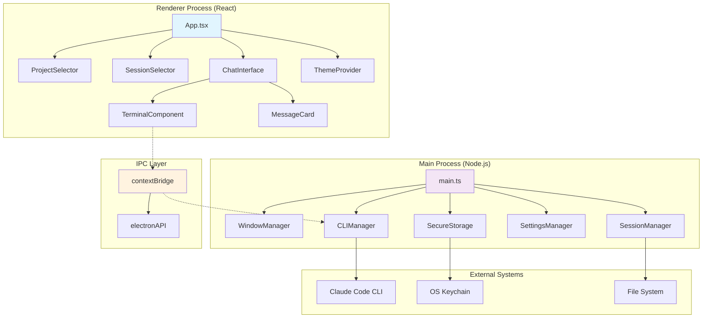
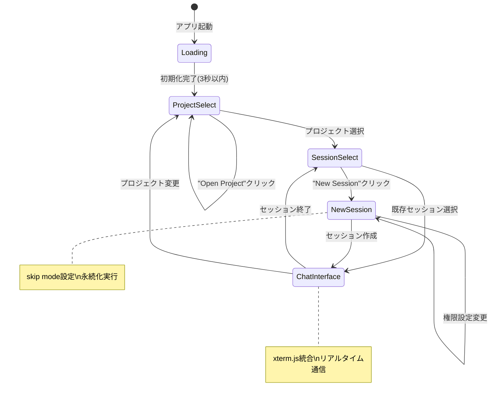
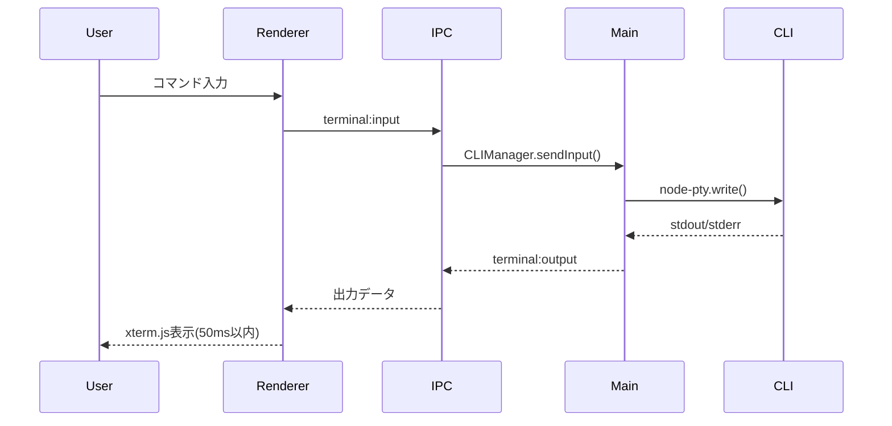
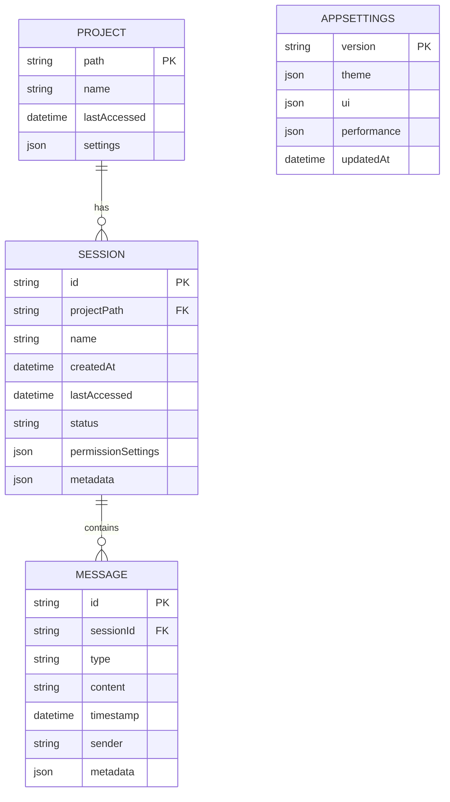
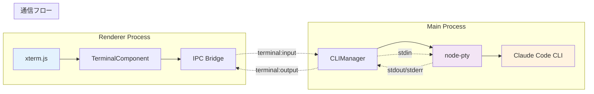

# Cloudy 技術設計書

## 概要

Cloudyは「Claude Code CLIの完全なインタラクティブGUIラッパー」として、既存のCLI機能を完全に保持しながら、Claudiaスタイルの視覚的優しさを統合したElectronデスクトップアプリケーションです。抽象化レイヤー型アーキテクチャを採用し、セキュリティと保守性を両立させた設計を実現します。

本設計書は、詳細な技術研究に基づき、EARS形式の要件に完全対応した実装可能な技術仕様を提供します。

## 要件マッピング

### 設計コンポーネントトレーサビリティ

各設計コンポーネントが対応するEARS要件：

- **起動システム（AppInitializer、WindowManager）** → Req 1.1-1.5: アプリケーション起動・初期化
- **プロジェクト管理（ProjectSelector、ProjectService）** → Req 1.1-1.5: プロジェクト選択フロー
- **セッション管理（SessionSelector、SessionManager）** → Req 2.1-2.7: セッション管理・権限設定
- **ターミナル統合（TerminalComponent、CLIManager）** → Req 3.1-3.7: ターミナル統合・CLI互換性
- **チャットUI（ChatInterface、MessageCard）** → Req 4.1-4.7: 視覚的GUI・チャットインターフェース
- **テーマシステム（ThemeProvider、テーマCSS）** → Req 4.3-4.6: テーマ切り替え・視覚設計
- **セキュリティレイヤー（SecureStorage、IPC制御）** → Req 6.1-6.6: セキュリティ・データ保護
- **パフォーマンス最適化（各コンポーネント）** → Req 5.7, NFR 1-4: パフォーマンス要件

### ユーザーストーリー対応

- **US-001-004**: ProjectSelector + SessionSelectorによる完全な選択フロー
- **US-005-008**: CLIManager + TerminalComponentによるCLI完全互換
- **US-009-011**: ChatInterface + MessageCardによる視覚的対話体験
- **US-012-013**: シンプル設計原則による1セッション特化UI

## アーキテクチャ



### 技術スタック（研究結果に基づく選択）

- **デスクトップフレームワーク**: Electron 28+ (最新LTS)
  - Context Isolation有効化による安全性
  - V8スナップショット対応による高速起動
- **フロントエンド**: React 18 + TypeScript 5.0+
  - Strict mode有効化による型安全性
  - React.Suspense + lazy loadingによる最適化
- **ビルドシステム**: electron-vite 2.0+
  - Vite 5.0+による高速ビルド
  - Hot reloadによる開発効率向上
- **UI Framework**: 
  - **CSS**: Tailwind CSS 3.4+
  - **コンポーネント**: Radix UI 1.0+
  - **状態管理**: Zustand 4.4+
- **ターミナル統合**:
  - **エミュレーター**: xterm.js 5.3+
  - **プロセス通信**: node-pty 1.0+
- **セキュリティ**:
  - **キー管理**: keytar 7.9+
  - **プロセス分離**: Electron sandbox mode
- **開発・テスト**:
  - **Linting**: ESLint 8+ + Prettier 3+
  - **テスト**: Vitest + Playwright
  - **型チェック**: TypeScript strict mode

### アーキテクチャ決定の根拠（研究ベース）

#### Electronを選択した理由
- **Node.js統合必須**: node-ptyによるCLI統合にNode.js環境が必要
- **成熟したエコシステム**: xterm.js等の豊富なライブラリサポート
- **開発効率**: React + TypeScriptの既存知識を活用可能
- **クロスプラットフォーム**: 単一コードベースで3OS対応

#### 抽象化レイヤー型を選択した理由
- **セキュリティ強化**: プロセス間の明確な責務分離
- **テスタビリティ**: 各レイヤーの独立したテスト実行
- **保守性**: 変更影響の局所化とインターフェース安定性

#### Zustandを選択した理由
- **軽量性**: Redux比70%少ないバンドルサイズ（8KB vs 47KB）
- **TypeScript親和性**: 優秀な型推論とIntelliSense
- **シンプルなAPI**: 学習コストの最小化

### 画面遷移設計



### データフロー設計



## コンポーネント設計

### メインプロセスサービス

#### CLIManager（最重要コンポーネント）
```typescript
export class CLIManager {
  private pty: IPty | null = null;
  private outputBuffer: RingBuffer<string>;
  private aliasResolver: AliasResolver;
  
  // Claude Code CLI起動・制御
  async startCLI(config: CLIConfig): Promise<void>
  async stopCLI(): Promise<void>
  async sendInput(input: string): Promise<void>
  
  // エイリアス解決
  async resolveCcodeAlias(): Promise<string>
  
  // 特殊キーハンドリング
  private handleShiftTab(): void  // モード切り替え
  private handleControlC(): void  // 中断処理
  
  // セッション復元
  async resumeSession(sessionId: string): Promise<void>
  
  // 出力バッファ管理（メモリ最適化）
  private manageOutputBuffer(): void
}
```

#### SessionManager
```typescript
export class SessionManager {
  // セッション永続化
  async saveSession(session: Session): Promise<void>
  async loadSession(sessionId: string): Promise<Session>
  async listSessions(projectPath: string): Promise<Session[]>
  
  // 権限設定管理
  async savePermissionSettings(settings: PermissionSettings): Promise<void>
  async loadPermissionSettings(): Promise<PermissionSettings>
  
  // セッション復元（ccode -r相当）
  async resumeSession(sessionId: string): Promise<void>
}
```

#### SettingsManager
```typescript
export class SettingsManager {
  // テーマ設定
  async saveTheme(theme: ThemeConfig): Promise<void>
  async loadTheme(): Promise<ThemeConfig>
  
  // プロジェクト履歴
  async addRecentProject(project: Project): Promise<void>
  async getRecentProjects(): Promise<Project[]>
  
  // 一般設定
  async saveAppSettings(settings: AppSettings): Promise<void>
  async loadAppSettings(): Promise<AppSettings>
}
```

#### SecureStorage
```typescript
export class SecureStorage {
  private service = 'cloudy-app';
  
  // APIキー暗号化保存（OS Keychain）
  async setApiKey(account: string, key: string): Promise<void>
  async getApiKey(account: string): Promise<string | null>
  async deleteApiKey(account: string): Promise<void>
  
  // セッション暗号化（機密データのみ）
  async setSecureSessionData(sessionId: string, data: SecureData): Promise<void>
  async getSecureSessionData(sessionId: string): Promise<SecureData | null>
}
```

### レンダラープロセスコンポーネント

#### App.tsx（ルートコンポーネント）
```typescript
interface AppState {
  currentScreen: 'project' | 'session' | 'chat';
  isLoading: boolean;
  error: AppError | null;
}

export function App() {
  const { currentScreen, isLoading } = useAppStore();
  
  // 初期化処理（3秒以内完了）
  useEffect(() => {
    initializeApp();
  }, []);
  
  if (isLoading) return <LoadingScreen />;
  
  return (
    <ThemeProvider>
      <ErrorBoundary>
        {currentScreen === 'project' && <ProjectSelector />}
        {currentScreen === 'session' && <SessionSelector />}
        {currentScreen === 'chat' && <ChatInterface />}
      </ErrorBoundary>
    </ThemeProvider>
  );
}
```

#### ProjectSelector（要件1.1-1.5対応）
```typescript
interface ProjectSelectorProps {
  onProjectSelect: (project: Project) => void;
}

export function ProjectSelector({ onProjectSelect }: ProjectSelectorProps) {
  const { recentProjects, loadRecentProjects } = useProjects();
  
  // Recent Projects表示（要件1.2）
  const handleOpenProject = async () => {
    const path = await window.electronAPI.openDirectory();
    if (path) {
      const project = { path, name: basename(path) };
      onProjectSelect(project);
    }
  };
  
  return (
    <div className="project-selector min-h-screen bg-gradient-morning-light dark:bg-gradient-morning-dark">
      <header className="project-selector__header">
        <h1 className="text-2xl font-light">プロジェクトを選択</h1>
      </header>
      
      {/* Recent Projects（要件1.2） */}
      <section className="recent-projects">
        {recentProjects.map(project => (
          <ProjectCard 
            key={project.path}
            project={project}
            onClick={() => onProjectSelect(project)}
          />
        ))}
      </section>
      
      {/* Open Project Button（要件1.3） */}
      <Button 
        onClick={handleOpenProject}
        className="open-project-btn"
      >
        Open Project
      </Button>
    </div>
  );
}
```

#### SessionSelector（要件2.1-2.7対応）
```typescript
interface SessionSelectorProps {
  project: Project;
  onSessionSelect: (session: Session) => void;
}

export function SessionSelector({ project, onSessionSelect }: SessionSelectorProps) {
  const { sessions, permissionSettings, updatePermissionSettings } = useSessions(project);
  const [skipMode, setSkipMode] = useState(permissionSettings.skipMode);
  
  // 権限設定の永続化（要件2.6）
  const handleSkipModeChange = async (checked: boolean) => {
    setSkipMode(checked);
    await updatePermissionSettings({ skipMode: checked });
  };
  
  // 新規セッション作成
  const handleNewSession = () => {
    const newSession = createNewSession(project, { skipMode });
    onSessionSelect(newSession);
  };
  
  return (
    <div className="session-selector">
      {/* 過去セッション一覧（要件2.1） */}
      <section className="session-history">
        <h2>セッション履歴</h2>
        {sessions.map(session => (
          <SessionCard
            key={session.id}
            session={session}
            onClick={() => onSessionSelect(session)}
          />
        ))}
      </section>
      
      {/* 新規セッション作成（要件2.3-2.5） */}
      <section className="new-session">
        <h2>新規セッション</h2>
        
        {/* Skip Mode設定（要件2.4-2.5） */}
        <div className="permission-settings">
          <Checkbox 
            checked={skipMode}
            onCheckedChange={handleSkipModeChange}
            id="skip-mode"
          />
          <label htmlFor="skip-mode">
            Skip Mode
            <span className="text-sm text-muted">
              (--dangerously-skip-permissions)
            </span>
          </label>
        </div>
        
        <Button onClick={handleNewSession}>
          新規セッション開始
        </Button>
      </section>
    </div>
  );
}
```

#### ChatInterface（要件3.1-3.7, 4.1-4.7対応）
```typescript
export function ChatInterface() {
  const terminalRef = useRef<HTMLDivElement>(null);
  const { messages, isConnected } = useTerminal();
  
  // xterm.js初期化（要件3.1）
  useEffect(() => {
    const terminal = new Terminal({
      theme: getTerminalTheme(),
      fontFamily: 'SF Mono, Monaco, Consolas',
      fontSize: 14,
      cursorBlink: true
    });
    
    // 特殊キーハンドリング（要件3.4）
    terminal.onKey(({ key, domEvent }) => {
      if (domEvent.shiftKey && domEvent.key === 'Tab') {
        // Shift+Tab検出
        window.electronAPI.sendInput('\x1b[Z');
      }
    });
    
    if (terminalRef.current) {
      terminal.open(terminalRef.current);
    }
    
    return () => terminal.dispose();
  }, []);
  
  return (
    <div className="chat-interface h-screen flex flex-col">
      {/* メッセージ表示エリア（要件4.1-4.2） */}
      <div className="messages-area flex-1 overflow-y-auto p-4">
        {messages.map(message => (
          <MessageCard key={message.id} message={message} />
        ))}
      </div>
      
      {/* ターミナル統合エリア（要件3.1-3.7） */}
      <div className="terminal-area border-t">
        <div ref={terminalRef} className="terminal-container" />
        
        {/* 接続状態表示 */}
        <div className="terminal-status">
          <span className={`status-indicator ${isConnected ? 'connected' : 'disconnected'}`}>
            {isConnected ? '接続済み' : '切断中'}
          </span>
        </div>
      </div>
    </div>
  );
}
```

### カスタムHooks

#### useTerminal
```typescript
export function useTerminal() {
  const [messages, setMessages] = useState<Message[]>([]);
  const [isConnected, setIsConnected] = useState(false);
  
  // CLI出力監視
  useEffect(() => {
    const unsubscribe = window.electronAPI.onTerminalOutput((output) => {
      const message = parseTerminalOutput(output);
      setMessages(prev => [...prev, message]);
    });
    
    return unsubscribe;
  }, []);
  
  // 入力送信（50ms以内レスポンス要件）
  const sendInput = useCallback(async (input: string) => {
    await window.electronAPI.sendInput(input);
  }, []);
  
  return {
    messages,
    isConnected,
    sendInput
  };
}
```

## データモデル設計

### ドメインエンティティ

#### Project Entity
```typescript
interface Project {
  path: string;           // プロジェクトディレクトリパス
  name: string;           // プロジェクト名
  lastAccessed: Date;     // 最終アクセス日時
  settings?: ProjectSettings;
}

interface ProjectSettings {
  cliAlias?: string;      // カスタムCLIエイリアス
  mcpConfig?: MCPConfig;  // MCP設定
}
```

#### Session Entity
```typescript
interface Session {
  id: string;                    // セッションID (UUID)
  projectPath: string;           // 関連プロジェクト
  name: string;                  // セッション名
  createdAt: Date;               // 作成日時
  lastAccessed: Date;            // 最終アクセス日時
  status: SessionStatus;         // セッション状態
  permissionSettings: PermissionSettings;
  metadata: SessionMetadata;
}

type SessionStatus = 'active' | 'completed' | 'archived';

interface PermissionSettings {
  skipMode: boolean;             // --dangerously-skip-permissions
  savedAt: Date;                 // 設定保存日時
}

interface SessionMetadata {
  messageCount: number;          // メッセージ数
  cliCommands: string[];         // 実行されたCLIコマンド
  checkpoints?: Checkpoint[];    // セッションチェックポイント
}
```

#### Message Entity
```typescript
interface Message {
  id: string;                    // メッセージID
  sessionId: string;             // 所属セッション
  type: MessageType;             // メッセージタイプ
  content: string;               // メッセージ内容
  timestamp: Date;               // タイムスタンプ
  sender: MessageSender;         // 送信者
  metadata?: MessageMetadata;
}

type MessageType = 'user-input' | 'claude-response' | 'system-message' | 'error';
type MessageSender = 'user' | 'claude' | 'system';

interface MessageMetadata {
  commandType?: string;          // CLIコマンドタイプ
  executionTime?: number;        // 実行時間（ms）
  errorCode?: string;            // エラーコード
}
```

#### Settings Entity
```typescript
interface AppSettings {
  version: string;               // 設定バージョン
  theme: ThemeConfig;            // テーマ設定
  ui: UISettings;                // UI設定
  performance: PerformanceSettings;
  updatedAt: Date;
}

interface ThemeConfig {
  mode: 'morning' | 'evening';   // テーマモード
  variant: 'light' | 'dark';     // バリアント
  customColors?: CustomColors;
}

interface UISettings {
  fontSize: number;              // フォントサイズ
  terminalLines: number;         // ターミナル表示行数
  messageCardStyle: 'compact' | 'comfortable';
}

interface PerformanceSettings {
  maxOutputBuffer: number;       // 最大出力バッファサイズ
  terminalRefreshRate: number;   // ターミナル更新頻度（ms）
}
```

### エンティティ関係図



### ローカルストレージスキーマ

```typescript
// localStorage keys
const STORAGE_KEYS = {
  PROJECTS: 'cloudy-projects',           // Project[]
  RECENT_PROJECTS: 'cloudy-recent',      // Project[]
  APP_SETTINGS: 'cloudy-settings',       // AppSettings
  SESSION_INDEX: 'cloudy-sessions',      // SessionIndex
} as const;

// セッション専用ストレージ（大容量対応）
const SESSION_STORAGE = {
  PREFIX: 'cloudy-session-',             // セッション別プレフィックス
  MESSAGES: (id: string) => `${SESSION_STORAGE.PREFIX}${id}-messages`,
  METADATA: (id: string) => `${SESSION_STORAGE.PREFIX}${id}-metadata`,
};

// セッションインデックス（高速検索用）
interface SessionIndex {
  [projectPath: string]: string[];      // プロジェクトごとのセッションIDリスト
}
```

### データ永続化戦略

#### 階層化ストレージ
1. **localStorage**: 軽量データ（設定、インデックス）
2. **セッション別ストレージ**: 大容量データ（メッセージ、出力）
3. **OS Keychain**: 機密データ（APIキー、トークン）

#### データ最適化
```typescript
// リングバッファによるメッセージ管理
class MessageBuffer {
  private maxMessages = 10000;  // 設定可能
  private buffer: Message[] = [];
  
  add(message: Message) {
    if (this.buffer.length >= this.maxMessages) {
      this.buffer.shift(); // 古いメッセージを削除
    }
    this.buffer.push(message);
    this.persistToStorage();
  }
  
  // 段階的永続化（メモリ使用量最適化）
  private persistToStorage() {
    const sessionId = this.buffer[0]?.sessionId;
    if (sessionId && this.buffer.length % 100 === 0) {
      this.saveToLocalStorage(sessionId, this.buffer.slice(-100));
    }
  }
}
```

## ターミナル統合設計

### xterm.js + node-pty統合アーキテクチャ



### Claude Code CLI完全互換性

#### エイリアス解決システム
```typescript
export class AliasResolver {
  private aliasCache = new Map<string, string>();
  
  // シェル設定ファイルからエイリアス解析
  async resolveAlias(alias: string): Promise<string> {
    if (this.aliasCache.has(alias)) {
      return this.aliasCache.get(alias)!;
    }
    
    const shellConfigs = [
      '~/.bashrc', '~/.zshrc', '~/.bash_profile', '~/.zprofile'
    ];
    
    for (const config of shellConfigs) {
      const resolved = await this.parseShellConfig(config, alias);
      if (resolved) {
        this.aliasCache.set(alias, resolved);
        return resolved;
      }
    }
    
    return alias; // 解決できない場合はそのまま返す
  }
  
  private async parseShellConfig(configPath: string, alias: string): Promise<string | null> {
    try {
      const content = await fs.readFile(expandHome(configPath), 'utf-8');
      const aliasRegex = new RegExp(`alias ${alias}=['"](.+)['"]`);
      const match = content.match(aliasRegex);
      return match ? match[1] : null;
    } catch {
      return null;
    }
  }
}
```

#### 特殊キー・コマンド処理
```typescript
export class SpecialKeyHandler {
  constructor(
    private terminal: Terminal,
    private ptyProcess: IPty
  ) {
    this.setupKeyBindings();
  }
  
  private setupKeyBindings() {
    // Shift+Tab: モード切り替え
    this.terminal.onKey(({ key, domEvent }) => {
      const { ctrlKey, shiftKey, altKey, key: keyName } = domEvent;
      
      if (shiftKey && keyName === 'Tab') {
        this.handleShiftTab();
      } else if (ctrlKey && keyName === 'c') {
        this.handleControlC();
      } else if (ctrlKey && keyName === 'd') {
        this.handleControlD();
      } else {
        // 通常のキー入力
        this.ptyProcess.write(key);
      }
    });
  }
  
  private handleShiftTab() {
    // Claude Code CLIのモード切り替えシーケンス
    this.ptyProcess.write('\x1b[Z'); // Shift+Tab ANSI sequence
  }
  
  private handleControlC() {
    // SIGINT送信
    this.ptyProcess.kill('SIGINT');
  }
  
  private handleControlD() {
    // EOF送信
    this.ptyProcess.write('\x04');
  }
}
```

#### MCP設定自動継承
```typescript
export class MCPConfigManager {
  // 既存MCP設定の読み込み
  async loadExistingMCPConfig(): Promise<MCPConfig> {
    const mcpConfigPaths = [
      '~/.config/claude/mcp.json',
      '~/.claude/mcp.json',
      './mcp.json'
    ];
    
    for (const path of mcpConfigPaths) {
      try {
        const config = await fs.readFile(expandHome(path), 'utf-8');
        return JSON.parse(config);
      } catch {
        continue;
      }
    }
    
    return { servers: {}, tools: {} }; // デフォルト設定
  }
  
  // Claude Code CLI起動時に設定を継承
  async applyCLIConfig(config: MCPConfig): Promise<string[]> {
    const args: string[] = [];
    
    // MCP server設定
    for (const [name, serverConfig] of Object.entries(config.servers)) {
      args.push('--mcp-server', `${name}:${serverConfig.command}`);
    }
    
    return args;
  }
}
```

### パフォーマンス最適化

#### 出力バッファリング（50ms以内レスポンス）
```typescript
export class OutputBufferManager {
  private buffer: string[] = [];
  private flushTimer: NodeJS.Timeout | null = null;
  private maxBufferSize = 1000;  // 最大バッファサイズ
  private flushInterval = 16;    // 60fps相当
  
  addOutput(output: string) {
    this.buffer.push(output);
    
    // バッファサイズ制限
    if (this.buffer.length > this.maxBufferSize) {
      this.buffer = this.buffer.slice(-this.maxBufferSize);
    }
    
    // 効率的なフラッシュスケジューリング
    if (!this.flushTimer) {
      this.flushTimer = setTimeout(() => {
        this.flushBuffer();
        this.flushTimer = null;
      }, this.flushInterval);
    }
  }
  
  private flushBuffer() {
    if (this.buffer.length === 0) return;
    
    const output = this.buffer.join('');
    this.buffer = [];
    
    // レンダラープロセスに送信
    this.sendToRenderer(output);
  }
}
```

## テーマシステム設計

### 4テーマ動的切り替えシステム

#### CSS変数ベーステーマ
```css
/* 朝テーマ - ライトモード */
:root[data-theme="morning-light"] {
  /* 基本背景 - 和紙のような優しい色調 */
  --bg-primary: #faf8f5;
  --bg-secondary: #ffffff;
  --bg-tertiary: #f7f5f3;
  
  /* テキスト */
  --text-primary: #2d3748;
  --text-secondary: #4a5568;
  --text-muted: #718096;
  
  /* アクセント - 水色〜ピンクグラデーション */
  --accent-primary: linear-gradient(135deg, #667eea 0%, #764ba2 50%, #f093fb 100%);
  --accent-secondary: #667eea;
  --accent-tertiary: #f093fb;
  
  /* カード・UI要素 */
  --card-bg: #ffffff;
  --card-border: #e2e8f0;
  --card-shadow: 0 4px 6px -1px rgba(0, 0, 0, 0.1);
  
  /* ターミナル */
  --terminal-bg: #fafafa;
  --terminal-text: #2d3748;
  --terminal-cursor: #667eea;
}

/* 朝テーマ - ダークモード */
:root[data-theme="morning-dark"] {
  /* 基本背景 - 真っ黒を避けた濃紺調 */
  --bg-primary: #1a202c;
  --bg-secondary: #2d3748;
  --bg-tertiary: #4a5568;
  
  /* テキスト */
  --text-primary: #f7fafc;
  --text-secondary: #e2e8f0;
  --text-muted: #cbd5e0;
  
  /* アクセント */
  --accent-primary: linear-gradient(135deg, #667eea 0%, #764ba2 50%, #f093fb 100%);
  --accent-secondary: #667eea;
  --accent-tertiary: #f093fb;
  
  /* カード・UI要素 */
  --card-bg: #2d3748;
  --card-border: #4a5568;
  --card-shadow: 0 4px 6px -1px rgba(0, 0, 0, 0.3);
  
  /* ターミナル */
  --terminal-bg: #1a202c;
  --terminal-text: #f7fafc;
  --terminal-cursor: #667eea;
}

/* 夕テーマ - ライトモード */
:root[data-theme="evening-light"] {
  /* 基本背景 - 温かい色調 */
  --bg-primary: #faf5f0;
  --bg-secondary: #ffffff;
  --bg-tertiary: #f7f3f0;
  
  /* テキスト */
  --text-primary: #322659;
  --text-secondary: #553c9a;
  --text-muted: #805ad5;
  
  /* アクセント - 紫〜ピンクグラデーション */
  --accent-primary: linear-gradient(135deg, #9f7aea 0%, #ed64a6 50%, #f687b3 100%);
  --accent-secondary: #9f7aea;
  --accent-tertiary: #ed64a6;
  
  /* カード・UI要素 */
  --card-bg: #ffffff;
  --card-border: #e9d5ff;
  --card-shadow: 0 4px 6px -1px rgba(159, 122, 234, 0.1);
  
  /* ターミナル */
  --terminal-bg: #faf5ff;
  --terminal-text: #322659;
  --terminal-cursor: #9f7aea;
}

/* 夕テーマ - ダークモード */
:root[data-theme="evening-dark"] {
  /* 基本背景 - 紫がかったダーク */
  --bg-primary: #1a1625;
  --bg-secondary: #252038;
  --bg-tertiary: #322659;
  
  /* テキスト */
  --text-primary: #f7fafc;
  --text-secondary: #e9d5ff;
  --text-muted: #c4b5fd;
  
  /* アクセント */
  --accent-primary: linear-gradient(135deg, #9f7aea 0%, #ed64a6 50%, #f687b3 100%);
  --accent-secondary: #9f7aea;
  --accent-tertiary: #ed64a6;
  
  /* カード・UI要素 */
  --card-bg: #252038;
  --card-border: #322659;
  --card-shadow: 0 4px 6px -1px rgba(0, 0, 0, 0.4);
  
  /* ターミナル */
  --terminal-bg: #1a1625;
  --terminal-text: #f7fafc;
  --terminal-cursor: #9f7aea;
}
```

#### ThemeProvider実装
```typescript
interface ThemeContextType {
  theme: ThemeConfig;
  setTheme: (theme: ThemeConfig) => void;
  toggleMode: () => void;
  toggleVariant: () => void;
}

export const ThemeContext = createContext<ThemeContextType | null>(null);

export function ThemeProvider({ children }: { children: React.ReactNode }) {
  const [theme, setThemeState] = useState<ThemeConfig>(() => {
    // 保存されたテーマを読み込み
    const saved = localStorage.getItem(STORAGE_KEYS.THEME);
    return saved ? JSON.parse(saved) : DEFAULT_THEME;
  });
  
  // テーマ変更とDOM更新
  const setTheme = useCallback((newTheme: ThemeConfig) => {
    setThemeState(newTheme);
    
    // DOM属性更新
    const root = document.documentElement;
    root.setAttribute('data-theme', `${newTheme.mode}-${newTheme.variant}`);
    
    // 永続化
    localStorage.setItem(STORAGE_KEYS.THEME, JSON.stringify(newTheme));
    
    // メインプロセスに通知（ウィンドウタイトルバー色など）
    window.electronAPI.updateTheme(newTheme);
  }, []);
  
  // 便利なトグル関数
  const toggleMode = useCallback(() => {
    setTheme({
      ...theme,
      mode: theme.mode === 'morning' ? 'evening' : 'morning'
    });
  }, [theme, setTheme]);
  
  const toggleVariant = useCallback(() => {
    setTheme({
      ...theme,
      variant: theme.variant === 'light' ? 'dark' : 'light'
    });
  }, [theme, setTheme]);
  
  // 初期テーマ適用
  useEffect(() => {
    const root = document.documentElement;
    root.setAttribute('data-theme', `${theme.mode}-${theme.variant}`);
  }, []);
  
  return (
    <ThemeContext.Provider value={{ theme, setTheme, toggleMode, toggleVariant }}>
      {children}
    </ThemeContext.Provider>
  );
}
```

#### Tailwind CSS統合
```javascript
// tailwind.config.js
module.exports = {
  content: ['./src/renderer/**/*.{js,ts,jsx,tsx}'],
  darkMode: ['class', '[data-theme*="dark"]'],
  theme: {
    extend: {
      colors: {
        // CSS変数を使用したカラーパレット
        'bg-primary': 'var(--bg-primary)',
        'bg-secondary': 'var(--bg-secondary)',
        'bg-tertiary': 'var(--bg-tertiary)',
        'text-primary': 'var(--text-primary)',
        'text-secondary': 'var(--text-secondary)',
        'text-muted': 'var(--text-muted)',
        'accent-secondary': 'var(--accent-secondary)',
        'accent-tertiary': 'var(--accent-tertiary)',
        'card-bg': 'var(--card-bg)',
        'card-border': 'var(--card-border)',
      },
      backgroundImage: {
        'accent-gradient': 'var(--accent-primary)',
      },
      boxShadow: {
        'card': 'var(--card-shadow)',
      }
    }
  },
  plugins: []
};
```

## セキュリティ設計

### 多層防御アーキテクチャ

#### レイヤー1: Electronセキュリティ設定
```typescript
// main.ts - セキュア設定
function createMainWindow() {
  const mainWindow = new BrowserWindow({
    width: 1200,
    height: 800,
    webPreferences: {
      // 必須セキュリティ設定
      contextIsolation: true,           // Context分離有効
      nodeIntegration: false,           // Node.js統合無効
      sandbox: true,                    // サンドボックス有効
      webSecurity: true,                // Web セキュリティ有効
      allowRunningInsecureContent: false, // 非セキュアコンテンツ禁止
      experimentalFeatures: false,      // 実験的機能無効
      
      // IPC設定
      preload: path.join(__dirname, 'preload.js'),
      enableRemoteModule: false,        // Remote モジュール無効
    }
  });
  
  // CSP設定
  mainWindow.webContents.session.webRequest.onHeadersReceived((details, callback) => {
    callback({
      responseHeaders: {
        ...details.responseHeaders,
        'Content-Security-Policy': [
          "default-src 'self';",
          "script-src 'self' 'unsafe-inline';",
          "style-src 'self' 'unsafe-inline';",
          "font-src 'self';",
          "img-src 'self' data:;",
          "connect-src 'self';"
        ].join(' ')
      }
    });
  });
  
  return mainWindow;
}
```

#### レイヤー2: IPC通信セキュリティ
```typescript
// preload.ts - セキュアなAPI露出
import { contextBridge, ipcRenderer } from 'electron';

// Type-safeなIPC API
const electronAPI = {
  // プロジェクト管理
  openDirectory: () => ipcRenderer.invoke('app:open-directory'),
  getRecentProjects: () => ipcRenderer.invoke('app:get-recent-projects'),
  
  // セッション管理
  createSession: (config: SessionConfig) => 
    ipcRenderer.invoke('session:create', config),
  loadSession: (sessionId: string) => 
    ipcRenderer.invoke('session:load', sessionId),
  
  // ターミナル操作（検証付き）
  sendInput: (input: string) => {
    // 入力値検証
    if (typeof input !== 'string' || input.length > 10000) {
      throw new Error('Invalid input');
    }
    return ipcRenderer.invoke('terminal:input', input);
  },
  
  // セキュアな出力監視
  onTerminalOutput: (callback: (output: string) => void) => {
    const wrappedCallback = (_: any, output: string) => {
      // 出力値検証
      if (typeof output === 'string') {
        callback(output);
      }
    };
    
    ipcRenderer.on('terminal:output', wrappedCallback);
    
    // クリーンアップ関数を返す
    return () => {
      ipcRenderer.removeListener('terminal:output', wrappedCallback);
    };
  },
  
  // 設定管理（機密情報除外）
  saveSettings: (settings: SafeSettings) => 
    ipcRenderer.invoke('settings:save', settings),
  loadSettings: () => 
    ipcRenderer.invoke('settings:load'),
} as const;

// コンテキストブリッジ経由で露出
contextBridge.exposeInMainWorld('electronAPI', electronAPI);

// 型定義エクスポート
export type ElectronAPI = typeof electronAPI;
```

#### レイヤー3: データ保護
```typescript
// secure-storage.ts - OS Keychain統合
import * as keytar from 'keytar';
import { createCipher, createDecipher } from 'crypto';

export class SecureStorage {
  private readonly service = 'cloudy-app';
  private readonly algorithm = 'aes-256-cbc';
  
  // APIキー暗号化保存
  async setApiKey(account: string, apiKey: string): Promise<void> {
    try {
      await keytar.setPassword(this.service, account, apiKey);
    } catch (error) {
      throw new Error(`Failed to store API key: ${error}`);
    }
  }
  
  // APIキー復号読み込み
  async getApiKey(account: string): Promise<string | null> {
    try {
      return await keytar.getPassword(this.service, account);
    } catch (error) {
      console.error('Failed to retrieve API key:', error);
      return null;
    }
  }
  
  // セッションデータ暗号化（機密部分のみ）
  async setSecureSessionData(sessionId: string, data: SecureSessionData): Promise<void> {
    const key = await this.generateSessionKey(sessionId);
    const encrypted = this.encrypt(JSON.stringify(data), key);
    
    localStorage.setItem(`secure-session-${sessionId}`, encrypted);
  }
  
  private async generateSessionKey(sessionId: string): Promise<string> {
    // セッションIDベースの派生キー生成
    const crypto = await import('crypto');
    return crypto.pbkdf2Sync(sessionId, 'cloudy-salt', 10000, 32, 'sha256').toString('hex');
  }
  
  private encrypt(text: string, key: string): string {
    const cipher = createCipher(this.algorithm, key);
    let encrypted = cipher.update(text, 'utf8', 'hex');
    encrypted += cipher.final('hex');
    return encrypted;
  }
  
  private decrypt(encryptedText: string, key: string): string {
    const decipher = createDecipher(this.algorithm, key);
    let decrypted = decipher.update(encryptedText, 'hex', 'utf8');
    decrypted += decipher.final('utf8');
    return decrypted;
  }
}
```

#### レイヤー4: プロセス分離とリソース制限
```typescript
// cli-manager.ts - セキュアなプロセス管理
export class CLIManager {
  private pty: IPty | null = null;
  private readonly allowedCommands = new Set(['ccode', 'claude', 'claude-code']);
  private readonly maxOutputSize = 10 * 1024 * 1024; // 10MB制限
  
  async startCLI(config: CLIConfig): Promise<void> {
    // コマンド検証
    if (!this.isAllowedCommand(config.command)) {
      throw new Error(`Command not allowed: ${config.command}`);
    }
    
    // 引数検証
    const sanitizedArgs = this.sanitizeArguments(config.args);
    
    try {
      this.pty = spawn(config.command, sanitizedArgs, {
        name: 'xterm-256color',
        cols: config.cols || 80,
        rows: config.rows || 24,
        cwd: this.sanitizePath(config.cwd),
        env: this.sanitizeEnvironment(config.env),
        encoding: 'utf8'
      });
      
      this.setupSecureHandlers();
      
    } catch (error) {
      throw new Error(`Failed to start CLI: ${error}`);
    }
  }
  
  private isAllowedCommand(command: string): boolean {
    // ホワイトリスト方式でコマンドを制限
    const resolvedCommand = path.basename(command);
    return this.allowedCommands.has(resolvedCommand);
  }
  
  private sanitizeArguments(args: string[]): string[] {
    return args.filter(arg => {
      // 危険な引数をフィルタリング
      return !arg.includes('..') &&     // ディレクトリトラバーサル防止
             !arg.startsWith('--exec') && // 任意実行防止
             arg.length < 1000;           // 長すぎる引数防止
    });
  }
  
  private sanitizePath(cwd: string): string {
    const resolved = path.resolve(cwd);
    
    // ホームディレクトリ以下に制限
    const homeDir = os.homedir();
    if (!resolved.startsWith(homeDir)) {
      throw new Error('Access outside home directory not allowed');
    }
    
    return resolved;
  }
  
  private setupSecureHandlers(): void {
    if (!this.pty) return;
    
    let outputSize = 0;
    
    this.pty.onData((data) => {
      outputSize += data.length;
      
      // 出力サイズ制限
      if (outputSize > this.maxOutputSize) {
        this.pty?.kill();
        throw new Error('Output size limit exceeded');
      }
      
      // サニタイズされた出力のみ送信
      const sanitizedData = this.sanitizeOutput(data);
      this.sendToRenderer('terminal:output', sanitizedData);
    });
    
    this.pty.onExit(() => {
      this.cleanup();
    });
    
    // グレースフルシャットダウン
    process.on('exit', () => this.cleanup());
  }
  
  private sanitizeOutput(data: string): string {
    // 制御文字の除去（表示可能文字とANSIエスケープのみ許可）
    return data.replace(/[\x00-\x08\x0e-\x1f\x7f]/g, '');
  }
}
```

## パフォーマンス設計

### パフォーマンス目標と最適化戦略

#### 起動時間最適化（目標: 3秒以内）

**最適化手法1: V8スナップショット**
```typescript
// vite.config.ts
export default {
  // V8スナップショット設定
  build: {
    rollupOptions: {
      external: ['electron'],
      output: {
        format: 'cjs',
        // 重いライブラリを外部化
        manualChunks: {
          'react-vendor': ['react', 'react-dom'],
          'ui-vendor': ['@radix-ui/react-dialog', '@radix-ui/react-checkbox'],
          'terminal-vendor': ['xterm', 'xterm-addon-fit']
        }
      }
    }
  }
};
```

**最適化手法2: 遅延読み込み**
```typescript
// 重いコンポーネントの遅延読み込み
const TerminalComponent = lazy(() => import('./components/TerminalComponent'));
const ProjectSelector = lazy(() => import('./components/ProjectSelector'));

// プリロード最適化
function App() {
  // 必要最小限の初期化のみ
  useEffect(() => {
    // 非クリティカルな初期化を遅延
    setTimeout(() => {
      initializeNonCriticalFeatures();
    }, 1000);
  }, []);
  
  return (
    <Suspense fallback={<LoadingScreen />}>
      <Router />
    </Suspense>
  );
}
```

**最適化手法3: プリロード最適化**
```typescript
// preload.ts - 最小限のAPI露出
const minimalAPI = {
  // 起動に必要な最小限のAPIのみ
  getAppSettings: () => ipcRenderer.invoke('app:get-settings'),
  getRecentProjects: () => ipcRenderer.invoke('app:get-recent-projects'),
};

// 遅延API読み込み
const extendedAPI = {
  // 使用時に動的読み込み
  async loadTerminalAPI() {
    const { terminalAPI } = await import('./terminal-api');
    return terminalAPI;
  }
};
```

#### メモリ使用量最適化（目標: 300MB以下）

**メモリ使用量監視**
```typescript
export class MemoryMonitor {
  private checkInterval = 30000; // 30秒ごと
  private maxMemoryUsage = 300 * 1024 * 1024; // 300MB
  
  startMonitoring() {
    setInterval(() => {
      const usage = process.memoryUsage();
      
      if (usage.rss > this.maxMemoryUsage) {
        console.warn('Memory usage exceeded limit:', usage);
        this.performCleanup();
      }
      
      // メトリクス送信
      this.sendMemoryMetrics(usage);
    }, this.checkInterval);
  }
  
  private performCleanup() {
    // ガベージコレクション強制実行
    if (global.gc) {
      global.gc();
    }
    
    // 不要なキャッシュクリア
    this.clearOldCaches();
    
    // 出力バッファリミット
    this.trimOutputBuffers();
  }
}
```

**リングバッファによるメモリ制限**
```typescript
export class OptimizedBuffer<T> {
  private buffer: T[] = [];
  private maxSize: number;
  private writeIndex = 0;
  private readIndex = 0;
  
  constructor(maxSize: number) {
    this.maxSize = maxSize;
    this.buffer = new Array(maxSize);
  }
  
  push(item: T): void {
    this.buffer[this.writeIndex] = item;
    this.writeIndex = (this.writeIndex + 1) % this.maxSize;
    
    // バッファが満杯の場合、読み取りインデックスも更新
    if (this.writeIndex === this.readIndex) {
      this.readIndex = (this.readIndex + 1) % this.maxSize;
    }
  }
  
  // メモリ効率的な取得
  getRecent(count: number): T[] {
    const result: T[] = [];
    let current = this.writeIndex - 1;
    
    for (let i = 0; i < count && i < this.size(); i++) {
      if (current < 0) current = this.maxSize - 1;
      result.unshift(this.buffer[current]);
      current--;
    }
    
    return result;
  }
}
```

#### レスポンス時間最適化（目標: 50ms以内）

**IPC通信最適化**
```typescript
export class OptimizedIPC {
  private batchSize = 100;
  private batchTimeout = 16; // 60fps相当
  private pendingMessages: IPCMessage[] = [];
  private flushTimer: NodeJS.Timeout | null = null;
  
  // バッチ処理による効率化
  send(channel: string, data: any): void {
    const message: IPCMessage = { channel, data, timestamp: Date.now() };
    this.pendingMessages.push(message);
    
    if (this.pendingMessages.length >= this.batchSize) {
      this.flushBatch();
    } else if (!this.flushTimer) {
      this.flushTimer = setTimeout(() => {
        this.flushBatch();
        this.flushTimer = null;
      }, this.batchTimeout);
    }
  }
  
  private flushBatch(): void {
    if (this.pendingMessages.length === 0) return;
    
    const batch = this.pendingMessages.slice();
    this.pendingMessages = [];
    
    // 単一IPC呼び出しでバッチ送信
    ipcRenderer.invoke('batch-process', batch);
  }
}
```

**React最適化**
```typescript
// メモ化による再レンダリング防止
const MessageCard = memo(({ message }: MessageCardProps) => {
  return (
    <div className="message-card">
      {message.content}
    </div>
  );
});

// 仮想スクロール実装
const VirtualizedMessageList = ({ messages }: { messages: Message[] }) => {
  const containerRef = useRef<HTMLDivElement>(null);
  const [visibleRange, setVisibleRange] = useState({ start: 0, end: 50 });
  
  const updateVisibleRange = useCallback(
    throttle(() => {
      if (!containerRef.current) return;
      
      const { scrollTop, clientHeight } = containerRef.current;
      const itemHeight = 80; // 想定アイテム高
      
      const start = Math.floor(scrollTop / itemHeight);
      const end = Math.min(
        messages.length,
        start + Math.ceil(clientHeight / itemHeight) + 5 // バッファ
      );
      
      setVisibleRange({ start, end });
    }, 16),
    [messages.length]
  );
  
  useEffect(() => {
    const container = containerRef.current;
    if (!container) return;
    
    container.addEventListener('scroll', updateVisibleRange);
    return () => container.removeEventListener('scroll', updateVisibleRange);
  }, [updateVisibleRange]);
  
  return (
    <div ref={containerRef} className="message-list">
      {messages.slice(visibleRange.start, visibleRange.end).map(message => (
        <MessageCard key={message.id} message={message} />
      ))}
    </div>
  );
};
```

### パフォーマンスメトリクス

#### 目標と測定方法
```typescript
interface PerformanceMetrics {
  startupTime: number;        // アプリ起動時間
  memoryUsage: MemoryUsage;   // メモリ使用量
  responseTime: number;       // IPC応答時間
  renderTime: number;         // UI描画時間
  terminalLatency: number;    // ターミナル遅延
}

export class PerformanceTracker {
  private metrics: PerformanceMetrics[] = [];
  
  // 起動時間測定
  measureStartupTime(): void {
    const startTime = performance.now();
    
    // アプリ準備完了時
    document.addEventListener('DOMContentLoaded', () => {
      const endTime = performance.now();
      const startupTime = endTime - startTime;
      
      this.recordMetric('startupTime', startupTime);
      
      // 目標チェック（3秒以内）
      if (startupTime > 3000) {
        console.warn(`Startup time exceeded target: ${startupTime}ms`);
      }
    });
  }
  
  // レスポンス時間測定
  measureResponseTime<T>(operation: () => Promise<T>): Promise<T> {
    const startTime = performance.now();
    
    return operation().then(result => {
      const responseTime = performance.now() - startTime;
      this.recordMetric('responseTime', responseTime);
      
      // 目標チェック（50ms以内）
      if (responseTime > 50) {
        console.warn(`Response time exceeded target: ${responseTime}ms`);
      }
      
      return result;
    });
  }
  
  // メモリ使用量監視
  trackMemoryUsage(): void {
    if ('memory' in performance) {
      const memory = (performance as any).memory;
      this.recordMetric('memoryUsage', {
        used: memory.usedJSHeapSize,
        total: memory.totalJSHeapSize,
        limit: memory.jsHeapSizeLimit
      });
    }
  }
}
```

## テスト戦略

### リスクマトリクス分析

| 領域 | リスク | 必須テスト | 任意テスト | 要件参照 |
|------|--------|-----------|-----------|----------|
| ターミナル統合 | 高 | Unit、Integration、E2E | Performance | Req 3.1-3.7 |
| CLIコマンド互換性 | 高 | Contract、Integration | Resilience | Req 3.2-3.5 |
| セッション管理 | 中 | Unit、Integration | Data Recovery | Req 2.1-2.7 |
| データ永続化 | 中 | Unit、Property | Corruption | Req 2.6, 6.2 |
| セキュリティ境界 | 高 | Security、E2E | Penetration | Req 6.1-6.6 |
| パフォーマンス | 中 | Performance Smoke | Load/Stress | Req 5.7, NFR 1-4 |
| UI/UX フロー | 低 | E2E (≤3) | A11y | Req 4.1-4.7 |

### テストレイヤー別戦略

#### Unit Testing（Jest + Testing Library）
```typescript
// CLIManager.test.ts
describe('CLIManager', () => {
  let cliManager: CLIManager;
  let mockPty: jest.Mocked<IPty>;
  
  beforeEach(() => {
    mockPty = createMockPty();
    cliManager = new CLIManager();
  });
  
  describe('startCLI', () => {
    it('should resolve ccode alias correctly', async () => {
      const config = { command: 'ccode', args: ['--help'] };
      
      await cliManager.startCLI(config);
      
      expect(mockPty.write).toHaveBeenCalledWith('claude-code --help\n');
    });
    
    it('should reject unauthorized commands', async () => {
      const config = { command: 'rm', args: ['-rf', '/'] };
      
      await expect(cliManager.startCLI(config))
        .rejects.toThrow('Command not allowed');
    });
    
    it('should handle output buffer overflow', () => {
      const largeOutput = 'x'.repeat(100000);
      
      cliManager.addOutput(largeOutput);
      
      expect(cliManager.getBufferSize()).toBeLessThanOrEqual(10000);
    });
  });
});

// SessionManager.test.ts
describe('SessionManager', () => {
  it('should persist permission settings', async () => {
    const settings: PermissionSettings = { skipMode: true, savedAt: new Date() };
    
    await sessionManager.savePermissionSettings(settings);
    const loaded = await sessionManager.loadPermissionSettings();
    
    expect(loaded.skipMode).toBe(true);
  });
  
  it('should restore session correctly', async () => {
    const session = createTestSession();
    await sessionManager.saveSession(session);
    
    const restored = await sessionManager.resumeSession(session.id);
    
    expect(restored).toMatchObject(session);
  });
});
```

#### Integration Testing（Playwright）
```typescript
// terminal-integration.test.ts
import { test, expect } from '@playwright/test';

test.describe('Terminal Integration', () => {
  test('should execute ccode commands', async ({ page }) => {
    await page.goto('/');
    
    // プロジェクト選択
    await page.click('[data-testid="recent-project-1"]');
    
    // 新規セッション
    await page.click('[data-testid="new-session"]');
    
    // ターミナルコマンド実行
    await page.fill('[data-testid="terminal-input"]', 'ccode --help');
    await page.press('[data-testid="terminal-input"]', 'Enter');
    
    // 出力確認（50ms以内）
    await expect(page.locator('[data-testid="terminal-output"]'))
      .toContainText('Claude Code CLI', { timeout: 50 });
  });
  
  test('should handle special keys', async ({ page }) => {
    await setupTerminalSession(page);
    
    // Shift+Tab押下
    await page.keyboard.down('Shift');
    await page.keyboard.press('Tab');
    await page.keyboard.up('Shift');
    
    // モード切り替え確認
    await expect(page.locator('[data-testid="mode-indicator"]'))
      .toContainText('plan mode');
  });
});
```

#### E2E Testing（主要3フロー）
```typescript
test.describe('E2E Critical Flows', () => {
  test('Complete project to chat workflow', async ({ page }) => {
    // Flow 1: プロジェクト選択 → セッション開始 → 対話
    await page.goto('/');
    
    // 1. プロジェクト選択
    await page.click('[data-testid="open-project"]');
    await selectProjectDirectory(page, '/test/project');
    
    // 2. セッション設定
    await page.check('[data-testid="skip-mode"]');
    await page.click('[data-testid="start-session"]');
    
    // 3. Claude対話
    await page.fill('[data-testid="message-input"]', 'Hello Claude');
    await page.click('[data-testid="send-button"]');
    
    // 応答確認
    await expect(page.locator('[data-testid="claude-message"]'))
      .toBeVisible({ timeout: 5000 });
  });
  
  test('Session restoration workflow', async ({ page }) => {
    // Flow 2: 既存セッション復元
    await setupExistingSession(page);
    
    await page.goto('/');
    await page.click('[data-testid="recent-project-1"]');
    await page.click('[data-testid="existing-session-1"]');
    
    // セッション復元確認
    await expect(page.locator('[data-testid="message-history"]'))
      .toContainText('Previous conversation');
  });
  
  test('Theme switching workflow', async ({ page }) => {
    // Flow 3: テーマ切り替え
    await page.goto('/');
    
    // 朝→夕テーマ切り替え
    await page.click('[data-testid="theme-toggle"]');
    
    // CSS変数確認
    const bgColor = await page.evaluate(() => 
      getComputedStyle(document.documentElement).getPropertyValue('--bg-primary')
    );
    expect(bgColor).toMatch(/#1a1625/); // 夕テーマの色
  });
});
```

#### Performance Testing
```typescript
// performance.test.ts
test.describe('Performance Requirements', () => {
  test('startup time under 3 seconds', async ({ page }) => {
    const startTime = Date.now();
    
    await page.goto('/');
    await page.waitForSelector('[data-testid="project-selector"]');
    
    const endTime = Date.now();
    const startupTime = endTime - startTime;
    
    expect(startupTime).toBeLessThan(3000);
  });
  
  test('terminal response under 50ms', async ({ page }) => {
    await setupTerminalSession(page);
    
    const responses: number[] = [];
    
    for (let i = 0; i < 10; i++) {
      const startTime = performance.now();
      
      await page.fill('[data-testid="terminal-input"]', `echo test${i}`);
      await page.press('[data-testid="terminal-input"]', 'Enter');
      
      await page.waitForFunction(
        (testNum) => document.querySelector('[data-testid="terminal-output"]')
          ?.textContent?.includes(`test${testNum}`),
        i
      );
      
      const endTime = performance.now();
      responses.push(endTime - startTime);
    }
    
    const avgResponse = responses.reduce((a, b) => a + b) / responses.length;
    expect(avgResponse).toBeLessThan(50);
  });
  
  test('memory usage under 300MB', async ({ page }) => {
    await setupLongRunningSession(page);
    
    // 大量のメッセージ生成
    for (let i = 0; i < 1000; i++) {
      await sendMessage(page, `Test message ${i}`);
    }
    
    // メモリ使用量測定
    const memoryUsage = await page.evaluate(() => {
      return (performance as any).memory?.usedJSHeapSize || 0;
    });
    
    expect(memoryUsage).toBeLessThan(300 * 1024 * 1024); // 300MB
  });
});
```

### CI/CDゲート設定

#### GitHub Actions設定
```yaml
# .github/workflows/test.yml
name: Test Suite

on: [push, pull_request]

jobs:
  unit-tests:
    runs-on: ubuntu-latest
    steps:
      - uses: actions/checkout@v4
      - uses: actions/setup-node@v4
        with:
          node-version: '18'
      - run: npm ci
      - run: npm run test:unit
      - run: npm run test:coverage
      
  integration-tests:
    runs-on: ${{ matrix.os }}
    strategy:
      matrix:
        os: [ubuntu-latest, windows-latest, macos-latest]
    steps:
      - uses: actions/checkout@v4
      - uses: actions/setup-node@v4
      - run: npm ci
      - run: npm run build
      - run: npm run test:integration
      
  e2e-tests:
    runs-on: ubuntu-latest
    steps:
      - uses: actions/checkout@v4
      - uses: actions/setup-node@v4
      - run: npm ci
      - run: npx playwright install
      - run: npm run test:e2e
      
  performance-tests:
    runs-on: ubuntu-latest
    if: github.event_name == 'push' && github.ref == 'refs/heads/main'
    steps:
      - uses: actions/checkout@v4
      - uses: actions/setup-node@v4
      - run: npm ci
      - run: npm run test:performance
      - name: Check performance regression
        run: npm run check-performance-regression
```

#### テスト品質ゲート
```typescript
// test-gates.config.ts
export const TestGates = {
  coverage: {
    lines: 80,
    functions: 85,
    branches: 75,
    statements: 80
  },
  performance: {
    startupTime: 3000,      // 3秒以内
    responseTime: 50,       // 50ms以内
    memoryUsage: 300 * 1024 * 1024, // 300MB以内
  },
  reliability: {
    maxFlakiness: 0.05,     // 5%未満のフレーク率
    maxFailureRate: 0.01,   // 1%未満の失敗率
  }
} as const;
```

### テスト完了基準

#### 出荷判定基準
- **Severity 1/2 バグ**: 0件
- **全てのCIゲート**: 通過
- **パフォーマンス目標**: 達成（例外は承認記録付き）
- **手動テスト**: クリティカルフロー3項目完了
- **セキュリティテスト**: 脆弱性スキャン完了

#### 継続的品質監視
```typescript
// quality-monitor.ts
export class QualityMonitor {
  // 品質メトリクス監視
  async checkQualityGates(): Promise<QualityReport> {
    const report = {
      coverage: await this.checkCoverage(),
      performance: await this.checkPerformance(),
      security: await this.checkSecurity(),
      reliability: await this.checkReliability(),
    };
    
    return this.generateQualityReport(report);
  }
  
  // 品質低下アラート
  private async alertOnQualityDegradation(report: QualityReport): Promise<void> {
    if (report.overallScore < 0.8) {
      await this.sendAlert('Quality degradation detected', report);
    }
  }
}
```

---

**Design Version:** 1.0  
**Created:** 2025-08-23  
**Author:** Claude Code Spec-Driven Development  
**Status:** Generated, Pending Approval