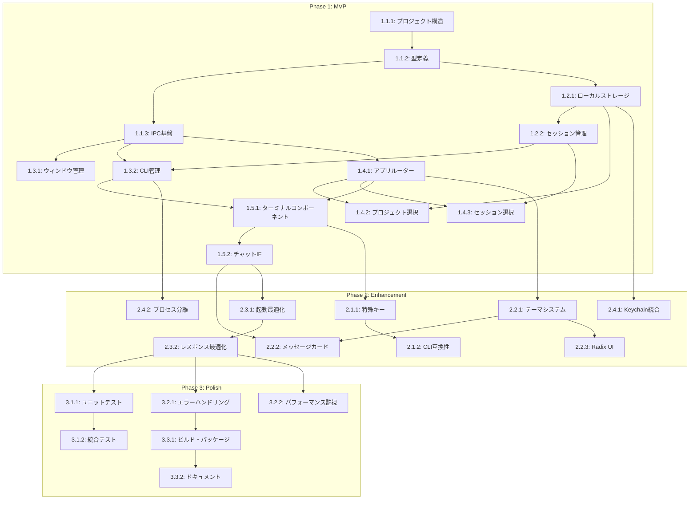

# Cloudy 実装タスク分解

## 概要

技術設計書に基づき、実装を3つのフェーズに分けて段階的に開発を進めます。各タスクは1-3日で完了可能な単位に分割し、依存関係を明確にして効率的な開発を実現します。

## フェーズ別実装計画

### Phase 1: MVP開発（Core機能）
基本的な動作に必要な最小限の機能を実装

### Phase 2: Enhancement（拡張機能）  
ユーザー体験を向上させる機能を追加

### Phase 3: Polish（品質向上）
テスト、パフォーマンス最適化、配布準備

---

## Phase 1: MVP開発（推定: 2-3週間）

### 1.1 プロジェクト基盤セットアップ

#### Task 1.1.1: プロジェクト構造作成
**工数**: Small (1日)  
**優先度**: Critical  
**依存**: なし

**作業内容**:
- Electron + Vite + React + TypeScript プロジェクト初期化
- ディレクトリ構造作成（src/main, src/renderer, src/shared）
- package.json設定、依存関係追加
- tsconfig.json、tailwind.config.js設定
- 基本的なビルド・開発環境構築

**完了条件**:
- `npm run dev`でElectronアプリが起動すること
- Hello World画面が表示されること

#### Task 1.1.2: 型定義・共通ユーティリティ
**工数**: Small (1日)  
**優先度**: High  
**依存**: 1.1.1

**作業内容**:
- `src/shared/types/`に基本型定義作成
  - Project, Session, Message, Settings インターフェース
- `src/shared/ipc-types.ts`にIPC通信インターフェース定義
- `src/shared/constants.ts`にアプリ定数定義
- `src/shared/utils.ts`に共通ユーティリティ関数

**完了条件**:
- TypeScriptコンパイルエラーなし
- 基本型定義が他モジュールから参照可能

#### Task 1.1.3: セキュアなIPC通信基盤
**工数**: Medium (2日)  
**優先度**: Critical  
**依存**: 1.1.2

**作業内容**:
- `src/main/preload.ts`作成、contextBridge設定
- セキュリティ設定（contextIsolation, nodeIntegration無効など）
- 基本的なIPC APIインターフェース実装
- レンダラープロセス側のelectronAPI型定義

**完了条件**:
- レンダラープロセスからメインプロセスのAPI呼び出し可能
- セキュリティ設定が正しく適用されていること

### 1.2 データ管理層

#### Task 1.2.1: ローカルストレージ管理
**工数**: Medium (2日)  
**優先度**: High  
**依存**: 1.1.2

**作業内容**:
- `src/main/managers/settings-manager.ts`実装
- プロジェクト履歴、アプリ設定の永続化
- localStorage操作の安全なラッパー
- エラーハンドリングとデータ検証

**完了条件**:
- 設定の保存・読み込み動作確認
- データ破損時の復旧機能動作確認

#### Task 1.2.2: セッション管理基盤
**工数**: Medium (3日)  
**優先度**: High  
**依存**: 1.2.1

**作業内容**:
- `src/main/managers/session-manager.ts`実装
- セッションCRUD操作
- セッション履歴管理
- 権限設定（skipMode）の永続化

**完了条件**:
- セッション作成・保存・復元機能の動作確認
- 権限設定の永続化確認

### 1.3 メインプロセス基盤

#### Task 1.3.1: ウィンドウ管理
**工数**: Small (1日)  
**優先度**: Medium  
**依存**: 1.1.3

**作業内容**:
- `src/main/managers/window-manager.ts`実装
- メインウィンドウ作成・管理
- ウィンドウ状態の保存・復元

**完了条件**:
- アプリケーション起動時にメインウィンドウが表示される
- ウィンドウサイズ・位置の保存・復元動作確認

#### Task 1.3.2: CLI管理基盤（最重要）
**工数**: Large (5日)  
**優先度**: Critical  
**依存**: 1.1.3, 1.2.2

**作業内容**:
- `src/main/managers/cli-manager.ts`実装
- node-ptyによるClaude Code CLI起動・制御
- エイリアス解決システム（ccode → claude-code）
- 基本的な入出力ハンドリング
- プロセスライフサイクル管理

**完了条件**:
- Claude Code CLIプロセス起動・終了確認
- 基本コマンド実行と出力取得確認
- ccodeエイリアス解決確認

### 1.4 レンダラープロセス基盤

#### Task 1.4.1: アプリケーションルーター
**工数**: Medium (2日)  
**優先度**: High  
**依存**: 1.1.3

**作業内容**:
- `src/renderer/App.tsx`実装
- 画面遷移管理（project → session → chat）
- Zustand状態管理基盤セットアップ
- エラーバウンダリ実装

**完了条件**:
- 基本的な画面遷移動作確認
- 状態管理の基本動作確認

#### Task 1.4.2: プロジェクト選択画面
**工数**: Medium (3日)  
**優先度**: High  
**依存**: 1.4.1, 1.2.1

**作業内容**:
- `src/renderer/components/ProjectSelector.tsx`実装
- Recent Projectsリスト表示
- "Open Project"ボタンとディレクトリ選択
- Claudiaスタイルのカード型UI実装

**完了条件**:
- プロジェクト履歴表示動作確認
- 新規プロジェクト選択機能確認
- UIデザインが仕様に準拠

#### Task 1.4.3: セッション選択画面
**工数**: Medium (3日)  
**優先度**: High  
**依存**: 1.4.1, 1.2.2

**作業内容**:
- `src/renderer/components/SessionSelector.tsx`実装
- 過去セッション一覧表示
- 新規セッション作成機能
- "Skip Mode"チェックボックス実装

**完了条件**:
- セッション履歴表示確認
- 新規セッション作成確認
- Skip Mode設定の永続化確認

### 1.5 ターミナル統合（MVP）

#### Task 1.5.1: 基本ターミナルコンポーネント
**工数**: Large (4日)  
**優先度**: Critical  
**依存**: 1.3.2, 1.4.1

**作業内容**:
- `src/renderer/components/TerminalComponent.tsx`実装
- xterm.js初期化・基本設定
- IPC経由でのCLI入出力
- 基本的なキー入力ハンドリング

**完了条件**:
- ターミナル画面表示確認
- 基本コマンド入力・出力表示確認
- IPC通信の安定動作確認

#### Task 1.5.2: チャットインターフェース基盤
**工数**: Medium (3日)  
**優先度**: High  
**依存**: 1.5.1

**作業内容**:
- `src/renderer/components/ChatInterface.tsx`実装
- ターミナルとメッセージエリアの統合レイアウト
- 基本的なメッセージ表示
- 画面下部の入力エリア

**完了条件**:
- チャット風UIレイアウト表示確認
- ターミナル統合動作確認

---

## Phase 2: Enhancement（推定: 2-3週間）

### 2.1 ターミナル機能強化

#### Task 2.1.1: 特殊キーハンドリング
**工数**: Medium (2日)  
**優先度**: High  
**依存**: 1.5.1

**作業内容**:
- Shift+Tab（モード切り替え）処理実装
- Ctrl+C、Ctrl+D処理実装
- 履歴ナビゲーション（↑↓キー）
- コピー&ペースト機能

**完了条件**:
- Shift+Tabでのモード切り替え確認
- 各種特殊キーの正常動作確認

#### Task 2.1.2: CLI完全互換性
**工数**: Medium (3日)  
**優先度**: High  
**依存**: 2.1.1

**作業内容**:
- /model、/permissions、/statusコマンド対応
- MCP設定自動継承
- セッション復元機能（-r相当）
- ビルトインコマンド完全サポート

**完了条件**:
- 全ビルトインコマンドの動作確認
- MCP設定継承確認
- セッション復元機能確認

### 2.2 UI/UX強化

#### Task 2.2.1: テーマシステム基盤
**工数**: Medium (3日)  
**優先度**: Medium  
**依存**: 1.4.1

**作業内容**:
- `src/renderer/components/ThemeProvider.tsx`実装
- CSS変数ベースのテーマ切り替え
- 4テーマ定義（朝/夕 × ライト/ダーク）
- テーマ設定の永続化

**完了条件**:
- 4テーマの表示確認
- テーマ切り替え機能確認
- 設定永続化確認

#### Task 2.2.2: メッセージカードUI
**工数**: Medium (2日)  
**優先度**: Medium  
**依存**: 1.5.2, 2.2.1

**作業内容**:
- `src/renderer/components/MessageCard.tsx`実装
- ロボットアイコン付きカード表示
- タイムスタンプ・送信者表示
- レスポンシブデザイン対応

**完了条件**:
- カード型UIの表示確認
- ロボットアイコン表示確認
- レスポンシブ動作確認

#### Task 2.2.3: Radix UI統合
**工数**: Medium (2日)  
**優先度**: Medium  
**依存**: 2.2.1

**作業内容**:
- ダイアログ、チェックボックス等のコンポーネント統合
- Tailwind CSSとの連携最適化
- アクセシビリティ対応
- 統一されたデザインシステム構築

**完了条件**:
- Radix UIコンポーネントの正常動作
- デザインの一貫性確認
- アクセシビリティ要件達成

### 2.3 パフォーマンス最適化

#### Task 2.3.1: 起動時間最適化
**工数**: Medium (3日)  
**優先度**: High  
**依存**: 全MVPタスク

**作業内容**:
- 遅延読み込み（React.lazy）実装
- プリロード最適化
- 不要なライブラリ除去
- ビルド最適化設定

**完了条件**:
- 起動時間3秒以内達成
- メモリ使用量300MB以下達成

#### Task 2.3.2: レスポンス時間最適化
**工数**: Medium (2日)  
**優先度**: High  
**依存**: 2.3.1

**作業内容**:
- IPC通信の最適化
- 出力バッファリング実装
- UI描画の最適化（仮想スクロール検討）
- メモリリーク対策

**完了条件**:
- ターミナル応答50ms以内達成
- UI反応200ms以内達成

### 2.4 セキュリティ強化

#### Task 2.4.1: OS Keychain統合
**工数**: Medium (3日)  
**優先度**: High  
**依存**: 1.2.1

**作業内容**:
- `src/main/managers/secure-storage.ts`実装
- keytar統合によるAPIキー暗号化
- セッションデータの安全な管理
- エラーハンドリング強化

**完了条件**:
- APIキー暗号化保存確認
- セキュアなデータ読み込み確認

#### Task 2.4.2: プロセス分離強化
**工数**: Small (2日)  
**優先度**: Medium  
**依存**: 1.3.2

**作業内容**:
- サンドボックス設定強化
- コマンド実行制限実装
- 入力値サニタイゼーション
- セキュリティログ実装

**完了条件**:
- セキュリティ設定の動作確認
- 不正な入力の適切な処理確認

---

## Phase 3: Polish（推定: 1-2週間）

### 3.1 テスト実装

#### Task 3.1.1: ユニットテスト
**工数**: Large (4日)  
**優先度**: High  
**依存**: Phase 2完了

**作業内容**:
- Jest + Testing Libraryセットアップ
- 主要コンポーネントのテスト実装
- CLIManager、SessionManagerテスト
- カバレッジ80%達成

**完了条件**:
- 全ユニットテストパス
- カバレッジ目標達成

#### Task 3.1.2: 統合テスト
**工数**: Medium (3日)  
**優先度**: Medium  
**依存**: 3.1.1

**作業内容**:
- Playwright E2Eテスト環境構築
- 主要3フローのE2Eテスト実装
- CIパイプライン設定
- テスト自動化

**完了条件**:
- E2Eテスト全パス
- CI/CD自動実行確認

### 3.2 品質向上

#### Task 3.2.1: エラーハンドリング強化
**工数**: Medium (2日)  
**優先度**: High  
**依存**: Phase 2完了

**作業内容**:
- 包括的エラー処理実装
- ユーザー向けエラーメッセージ改善
- ログ機能実装
- 復旧機能実装

**完了条件**:
- エラー処理の網羅性確認
- ユーザビリティテスト合格

#### Task 3.2.2: パフォーマンス計測・監視
**工数**: Small (2日)  
**優先度**: Medium  
**依存**: 2.3.2

**作業内容**:
- パフォーマンス計測機能実装
- メトリクス収集・表示
- ベンチマークテスト作成
- パフォーマンス回帰検証

**完了条件**:
- 全パフォーマンス目標達成確認
- 継続監視機能動作確認

### 3.3 配布準備

#### Task 3.3.1: ビルド・パッケージング
**工数**: Medium (2日)  
**優先度**: High  
**依存**: 3.2.1

**作業内容**:
- electron-builder設定完成
- macOS/Windows/Linux向けビルド
- コード署名設定
- 自動アップデート機能

**完了条件**:
- 各プラットフォーム用パッケージ作成確認
- インストール・アップデート動作確認

#### Task 3.3.2: ドキュメント作成
**工数**: Medium (2日)  
**優先度**: Medium  
**依存**: 3.3.1

**作業内容**:
- README.md作成
- インストール・使用方法ドキュメント
- 開発者向けドキュメント
- トラブルシューティングガイド

**完了条件**:
- ドキュメント完成
- ユーザビリティテスト合格

---

## 依存関係ダイアグラム

## 工数見積もり・スケジュール

### 工数サマリ
- **Phase 1 (MVP)**: 20-25日（3-4週間）
- **Phase 2 (Enhancement)**: 15-20日（2-3週間）  
- **Phase 3 (Polish)**: 8-12日（1-2週間）
- **総計**: 43-57日（6-8週間）

### 並行作業可能なタスク
- UI関連タスク（1.4.x, 2.2.x）は並行実行可能
- セキュリティ関連タスク（2.4.x）は独立実行可能
- テスト関連タスク（3.1.x）は部分並行可能

### クリティカルパス
1. **プロジェクト基盤** → **CLI管理** → **ターミナル統合** → **UI統合** → **最適化**
2. 最も重要: Task 1.3.2 (CLI管理基盤) - ここが失敗すると全体に影響

### リスク評価
- **高リスク**: CLI統合（1.3.2, 2.1.x） - 外部CLI依存
- **中リスク**: パフォーマンス最適化（2.3.x） - 要件達成の不確実性
- **低リスク**: UI実装（1.4.x, 2.2.x） - 既知技術

---

**Document Version:** 1.0  
**Created:** 2025-08-23  
**Total Tasks:** 34個  
**Estimated Duration:** 6-8週間  
**Status:** Generated, Ready for Implementation